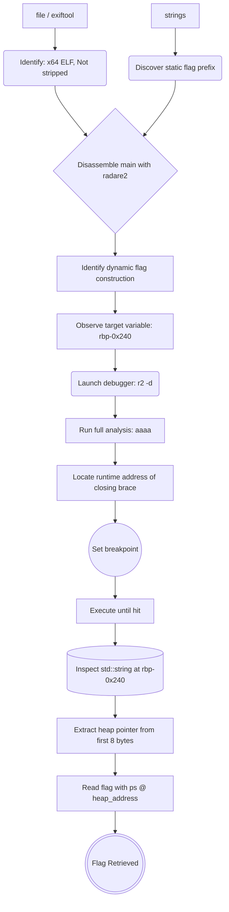

## Tools Utilized

To execute the assessment methodology, specific utilities and toolkits are leveraged:

| Tool | Version / Reference | Purpose |
| :--- | :--- | :--- |
| **file / exiftool** | — | Initial binary identification and metadata triage |
| **strings** | GNU binutils | Extracting printable strings and library dependencies |
| **radare2** | v5.9+ | Static disassembly, analysis, and dynamic debugging (with `-d` flag) |
| **radare2 (debug mode)** | v5.9+ | Runtime breakpoint placement and memory inspection |

---

## Challenge Setup & Context
To get started, access the CyLab platform and navigate to the **FactCheck** challenge within the reverse engineering category. The challenge description simply states: _"This binary is assembling a piece of important information... Can you discover it? Examine this file. Do you understand its internal workings?"_ The goal is to analyze the binary, which stores the *flag* in memory.


---

## 1. Initial Static Triage

Once the binary is downloaded, an initial identification pass is performed using the `file`, `exiftool`, and `strings` utilities to determine its architecture and extract any immediately visible information.

```bash
file bin
exiftool bin
```


```bash
strings -n 10 bin
```


The `file` command reveals a **64-bit ELF shared object for x86-64**, compiled in C++ and **not stripped**, meaning function names and symbols remain intact. `exiftool` confirms the technical details and compilation environment. Most significantly, the `strings` output immediately exposes a critical clue: the flag prefix `picoCTF{wELF_d0N3_mate_}` is present as a plaintext string within the binary. This discovery confirms that the flag is not fully static but rather constructed by concatenating a base prefix with an additional dynamic component, likely generated or validated at runtime.

---

## 2. Disassembly with radare2

The binary is loaded into radare2 with the `-A` flag to activate the automatic analysis sequence, which resolves imports, function boundaries, and cross-references.

```bash
r2 -A bin
```
Since the binary is not stripped, the `main` symbol is readily available. We navigate directly to it and disassemble its full body to understand the program's control flow:
```bash
s main
pdf
```

Disassembly reveals that the program uses the C++ standard library `(std::__cxx11::basic_string)` and constructs the flag piece by piece. Initially, the loading of the base prefix is ​​observed.


At `0x000012c5`, the instruction `lea rsi, str.picoCTF{wELF_d0N3_mate_` loads the static prefix into a string object. Subsequently, multiple conditional blocks determine which additional fragments are concatenated to this base.

One such block is shown below:


In this fragment:

- The character at index 0 of `var_a0h` is extracted (`operator[]`).
- It is compared with 'A' (`cmp al, 0x41`).
- If the character **is not** 'A', the `setne` instruction sets `al = 1`, and the subsequent `test` + `je` causes a jump that **skips** the concatenation.
- If the character **is** 'A' (`al = 0`), the jump is not taken, and `var_60h` is appended to the flag via `operator+=`.
- The destination of this concatenation is `var_240h` (`rbp-0x240`). 

This pattern repeats throughout the function, each condition evaluates a character to decide whether to concatenate a fragment. All concatenations target `var_240h` (`rbp-0x240`), which receives the base prefix and finally the closing brace `}` at `0x00001853` (`mov esi, 0x7d`). The function prologue places `var_240h` at `rbp-0x240`, confirming the complete flag resides there after assembly.


Since the program never prints the flag, the next phase involves dynamic debugging to capture it from memory.

---

## 3. Dynamic Debugging with radare2

Since the binary does not output the flag to stdout, a dynamic approach is required to inspect the string after it has been fully assembled in memory. The strategy is to run the program under `radare2`'s debugger, set a breakpoint at the instruction that appends the final closing brace (`}`), and then read the flag from memory.

First, launch the binary in debug mode:

```bash
r2 -d ./bin
```

Because the binary is PIE (_Position Independent Executable_), the addresses are randomized at runtime. During static analysis, we only had relative offsets. However, once the binary is loaded in the debugger, we perform a full analysis (`aaaa`) on the **running process**. This resolves all symbols and functions with their **actual runtime addresses**, which vary with each execution but are now directly visible in the disassembly.

```bash
aaaa
```

With the dynamic analysis complete, we navigate to `main` and disassemble it:

```bash
s main
pdf
```


In the disassembly, we can now directly see the **runtime address** of the instruction that appends the closing brace. In this session, it is: `0x5572a6241853`


We set a breakpoint at that exact runtime address:

```bash
db 0x5572a6241853
```

Now continue execution until the breakpoint is hit:

```
dc
```

The program pauses just before appending the closing brace. As established during the static analysis, the flag is stored in the `std::string` object at `rbp-0x240` (the variable `var_240h`). We inspect its internal structure:

```bash
pxw 32 @ rbp-0x240
```

and, The output reveals the layout of the `std::string` object:


In libstdc++, a `std::string` stores:

- **Bytes 0–7**: Pointer to the heap buffer containing the actual characters.
- **Bytes 8–15**: Current size (length) of the string.
- **Bytes 16–23**: Capacity of the allocated buffer.

The first 8 bytes (`0xabeb7340 0x00005572`) represent the heap pointer. As noted in the `exiftool` output, this binary uses **little‑endian** byte ordering, meaning the bytes are stored in reverse order: the least significant byte comes first. Reconstructing the address from these bytes gives `0x5572abeb7340`. The next 8 bytes (`0x0000001f`) indicate a string length of **31** characters, which matches the expected flag length.

We read the string directly from the heap address:

```bash
ps @ 0x5572abeb7340
```

The output reveals the complete flag (without the final `}`, since the breakpoint is set before that character is concatenated); adding the closing brace provides the full flag.


---

## 4. Solve Chain Summary

