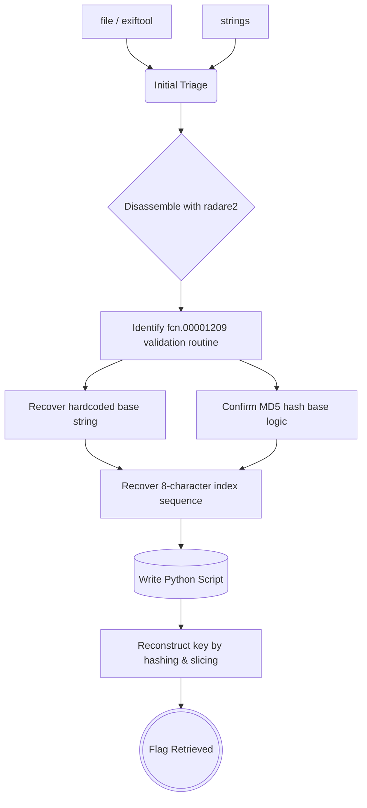

## Tools Utilized

To execute the assessment methodology, specific utilities and toolkits are leveraged:

| Tool | Version / Reference | Purpose |
| :--- | :--- | :--- |
| **file / exiftool** | — | Initial binary identification and metadata triage |
| **strings** | GNU binutils | Extracting printable strings and library dependencies |
| **radare2** | v5.9+ | Disassembly, static analysis, and function cross-referencing |
| **Python** | v3.12+ | Algorithm replication and key reconstruction (`hashlib`) |

---


## Challenge Setup & Context

To begin, access the CyLab platform and navigate to the **Keygenme** challenge under the Reversing Engineering category. The description simply asks: _"Can you get the flag? Reverse engineer this binary."_ The objective is offline reverse engineering: analyzing the executable's internal logic to extract or reconstruct a valid key.


---

## 1. Initial Static Interaction

Once the binary is downloaded and marked as executable, an initial identification pass is performed to determine its architecture using the `file` and `exiftool` utilities.

```bash
file keygenme
exiftool keygenme
```


The output reveals a **64-bit ELF, LSB PIE executable for the x86-64 architecture**. The binary is **stripped**, meaning symbol names have been removed. The file size is noticeably small at just 14 kB. To gather more context before diving into the disassembly, we extract printable characters using the `strings` command to identify potential execution paths or external dependencies.


The strings output reveals a dependency on **libcrypto.so.1.1**, indicating the use of standard cryptographic functions. It also exposes hardcoded prompts (such as "Enter your license key:" and validation messages) that will serve as critical entry points for cross-referencing.

---

## 2. Disassembly with radare2

The binary is loaded into radare2 using the `-A` option to activate the automatic analysis sequence, which resolves imports, function boundaries, and cross-references.

```bash
r2 -A keygenme 
```

Disassembling the default `entry0` location with the `pdf` command reveals the standard glibc entry stub. The key detail lies at the end of this routine: the address of `main` is loaded into the `rdi` register just before the call to `__libc_start_main`. Radare2 detects this standard convention and automatically recovers the `main` symbol, providing us with a direct address to jump straight to the application's core logic.

```bash
pdf 
```


After retrieving the main steering assembly, locate it directly and disassemble its entire body:

```bash
s main 
pdf 
```


The disassembly reveals a standard stack canary preceding the core logic. The program prints the prompt and calls fgets to read exactly **0x25 (37)** bytes of user input into a stack buffer. This buffer is immediately passed via the rdi register to `fcn.00001209`. The return value in "al" dictates the branch to either the **"valid"** or "**"invalid"** success messages. This flow clearly identifies "fcn.00001209" as the next target.

We step into the validation routine to disassemble its logic:

```bash
s fcn.00001209
pdf
```


The disassembly reveals a sequence of `movabs` instructions that push 64-bit immediate values ​​onto the stack. Radare2 translates these values ​​into ASCII, exposing the base string `picoCTF{br1ng_y0ur_0wn_k3y_}`, which is dynamically reconstructed in memory to evade static analysis. The function generates an MD5 hash of this string and stores it on the stack, immediately followed by a second hash. Subsequently, both hashes are converted into readable hexadecimal strings before proceeding to the final validation phase.


The destination pointer for the primary digest conversion is set via the `lea rcx, [var_70h]` instruction, designating that address as index 0 of the resulting 32-character hexadecimal string. Once the base address of the valid hash at `var_70h` is confirmed, the binary dynamically constructs the final license key by concatenating specific characters directly onto the base string hardcoded in the program and appending a closing key:


Each `movzx/mov` pair performs a direct memory copy. Since the hash is written sequentially starting at **var_70h**, the offset of each variable reveals its exact index via the formula: `index = 0x70 - offset`. For example `movzx eax, byte [var_63h]` corresponds to `0x70 - 0x63 = 0x0D (13)`, extracting the fourteenth character (index 13). Applying this same logic to every line in the block, in the exact order the binary reads them, produces the full extraction sequence:

|**Variable**|**Offset from base**|**Index**|
|---|---|---|
|var_63h|0x70 − 0x63|**13**|
|var_5eh|0x70 − 0x5e|**18**|
|var_53h|0x70 − 0x53|**29**|
|var_6fh|0x70 − 0x6f|**1**|
|var_62h|0x70 − 0x62|**14**|
|var_58h|0x70 − 0x58|**24**|
|var_56h|0x70 − 0x56|**26**|
|var_53h|0x70 − 0x53|**29**|

The hash itself remains a standard MD5 hash written sequentially. The true obfuscation lies in the selection order within the binary. Instead of reading the hash linearly, the process targets eight predetermined positions to extract a single character from each. Recovering this exact non-linear sequence allows for the byte by byte reconstruction of the key's final 8 character segment, which is inserted just before the closing brace `}`.


Once the entire validation logic has been defined, the final step consists of programmatically replicating this entire process and reconstructing the valid key without needing to execute the binary itself.

---

## 3. Key Reconstruction & Validation

The entire validation logic can be replicated in `Python` without touching the binary again. The script reproduces the exact sequence observed during analysis: hashing the hardcoded base string, extracting the eight characters at the recovered indices, and appending the closing brace.

```python
import hashlib

base = "picoCTF{br1ng_y0ur_0wn_k3y_"
digest = hashlib.md5(base.encode()).hexdigest()

indices = [13, 18, 29, 1, 14, 24, 26, 29]
extracted = "".join(digest[i] for i in indices)

key = base + extracted + "}"
print(key)
```

Running this script locally reconstructs the exact 36-character key expected by the binary's comparison routine. With the key successfully reconstructed the challenge is solved — the flag is the key itself: 


---

## 4. Solve Chain Summary

